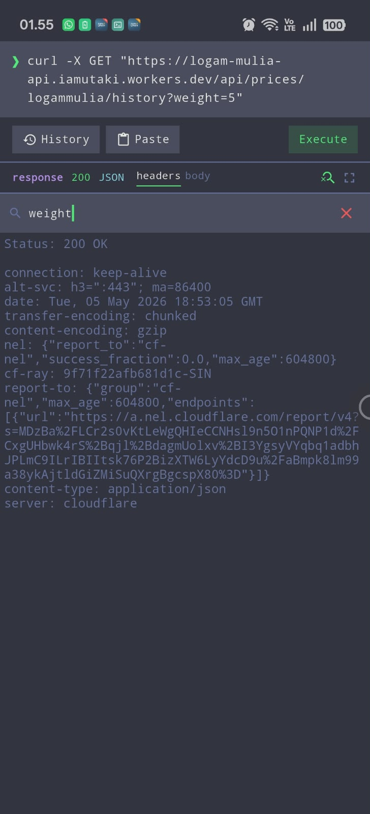
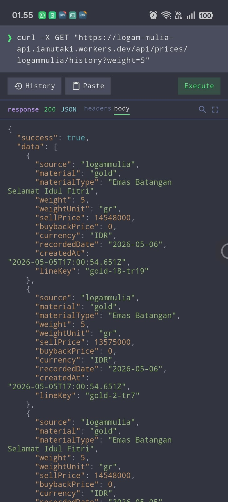

<!-- GitAds-Verify: 4VNFAH4816B7FFB8UG86ZPXZZBKXZ9L8 -->

# Curel

  

A lightweight networking utility focused on loading, fetching, and streaming data efficiently over HTTP.

## Preview

| | |
|:---:|:---:|
|  |  |

## Features

- Paste and execute curl commands
- Syntax-highlighted response
- Search within response with match highlighting
- HTML preview