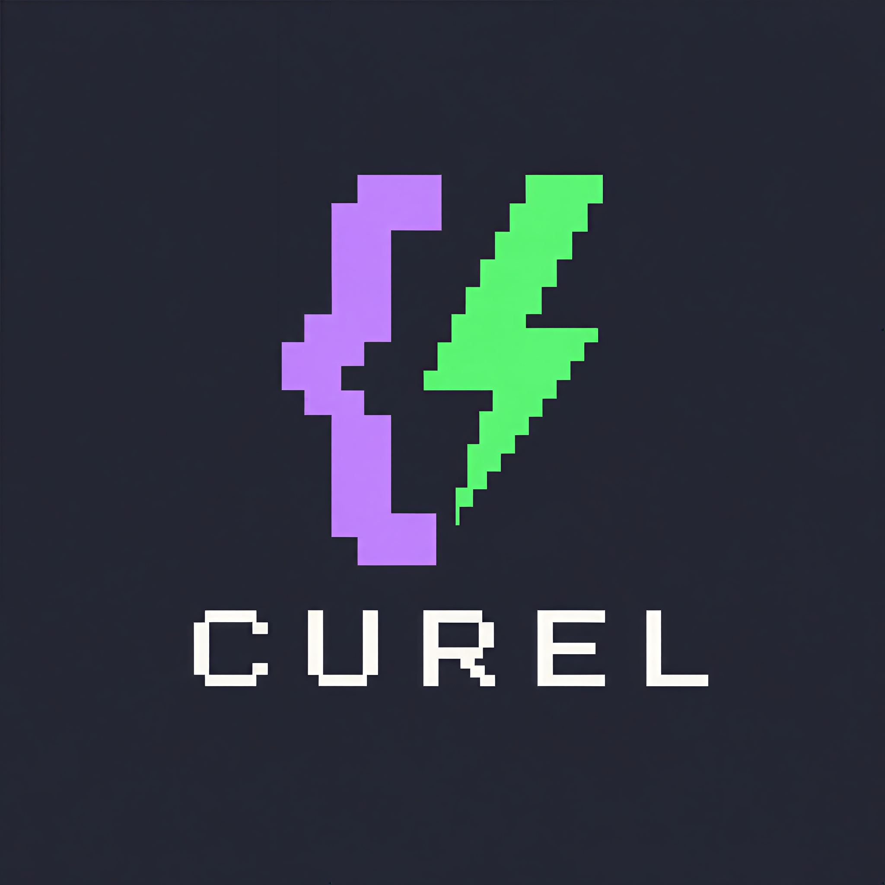
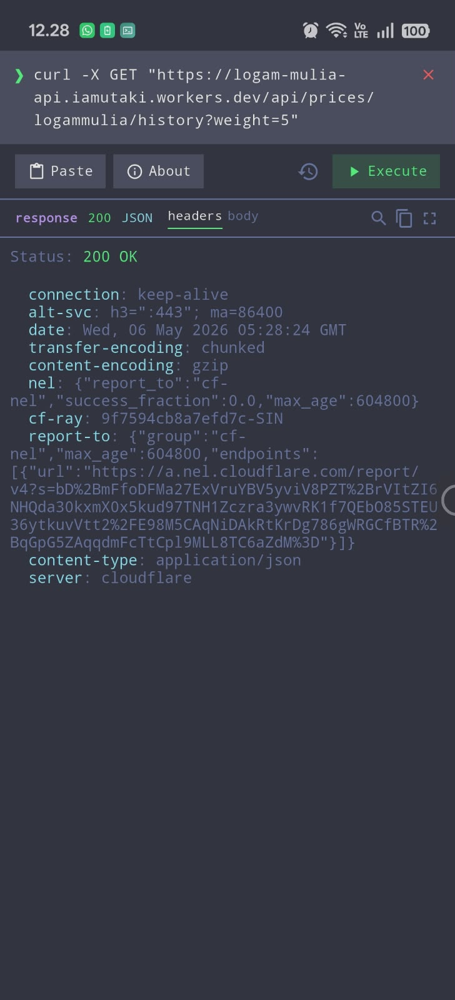
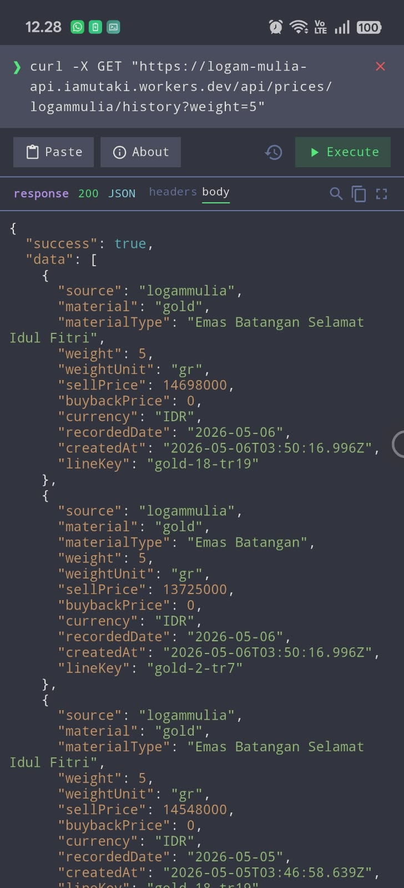
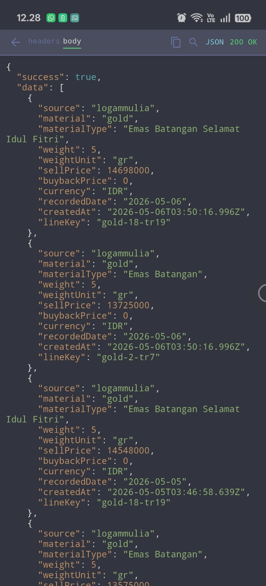

# Curel

/ˈtʃurɛl/

  

A free, open-source, git-native curl workspace. Local-first - your data stays on your device, synced through your own git repositories. No cloud, no accounts, no tracking.

> This application is fully developed with AI assistance.

## GitAds Sponsored

## Preview

|  |  |
|:---:|:---:|
|  |  |
|  |  |

## Download

Download the latest release from the [Releases](https://github.com/cacing69/curel/releases) page.

## Why Curel?

- **Free & open source** - no subscriptions, no locked features
- **Local-first & private** - your requests, tokens, and environments stay on your device. nothing is sent to any server unless you explicitly sync
- **Git-native sync** - sync projects through your own github, gitlab, or gitea repositories. self-hosted supported
- **Raw curl-based** - paste, edit, and execute real curl commands. no proprietary format lock-in

## Features

### HTTP Client

- Paste and execute curl commands
- Request builder for constructing HTTP requests visually
- Curl cheat sheet with syntax-highlighted examples
- Support for common curl flags: `-L`, `-v`, `--data`, `--data-raw`, `-o`, `-O`, `--trace`, `--trace-ascii`, `--connect-timeout`, `--max-time`, `-k`
- Syntax-highlighted response with JSON prettify
- Search within response with match highlighting
- HTML preview tab
- Verbose output with DNS lookup, TLS info, and redirect chain
- Trace output with hex dump format
- Save response to file

### Environments

- Environment variables with `<<VAR>>` syntax and purple highlighting
- Multiple environments with quick switch from action bar
- Layered env resolution: project env > global env > undefined warning
- Import/export environments as JSON
- Secure variable storage (Keychain/Keystore)

### Projects & Organization

- Filesystem-first project organization
- Save and open requests with folder support
- Request drawer with search, rename, and delete
- Status code badges from request metadata
- Custom workspace location

### Git Sync

- Sync projects to github, gitlab, or gitea repositories (self-hosted supported)
- Pull, push, and combined sync with 3-layer safety (optimistic lock, delete propagation, fast-forward check)
- Conflict detection and resolution (pull overwrite / push overwrite)
- Sync status indicators across the UI
- Connect/disconnect git per project

### Settings & Theme

- Configurable User-Agent, connect-timeout, and max-time
- Dracula theme with flat, no-shadow terminal design
- Share curl command via system share sheet
